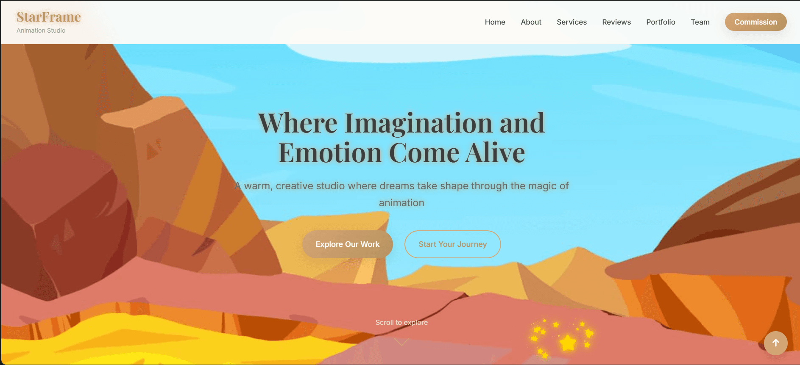
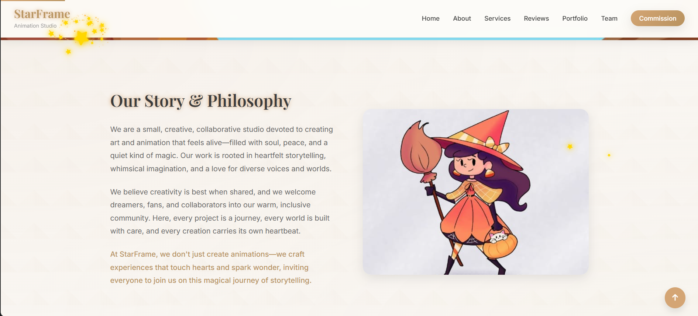

<<<<<<< HEAD
# starframe
Official website of Starframe Animation Studios
=======
# 🛡️ StarFrame Admin System

**A comprehensive admin dashboard system for monitoring and managing the StarFrame Animation Studio website with advanced security features, analytics, and real-time monitoring.**
# StarFrame Animation Studio — Website & Admin

This repository contains the StarFrame Animation Studio front-end website and an accompanying Node.js admin backend used for commissions, analytics, and administrative workflows.

This README has been rewritten to provide a clear, formal project overview and to include screenshots of the current site pages.

## Project overview

- Public static site built with HTML, CSS, and vanilla JavaScript.
- Admin and API routes implemented with Node.js and Express (in `server/`).
- Commission system with client-side invoice generation and server-side email support (serverless endpoints under `api/` for Vercel).

## Key features

- Commission form with service selection, budget ranges and payment options.
- Invoice generation and PDF emailing (via server or serverless functions).
- Admin dashboard and analytics routes (in `server/admin` and `server/routes`).
- Static portfolio pages and supporting assets (images, CSS, JS).

## Running locally (development)

Prerequisites: Node.js (14+), npm

1. Install dependencies:

```powershell
npm install
```

2. Start the server in development mode (uses `server/server.js`):

```powershell
npm run dev
```

Open `http://localhost:3001` in your browser and navigate to pages such as `/commission.html`.

Notes:
- Environment variables are used for session secrets and SMTP credentials. See `VERCEL_README.md` for production / Vercel guidance.

## Deployment

You can deploy the static site and serverless endpoints to Vercel (a `vercel.json` has been added). For larger, stateful server deployments consider Render, Railway, or a VPS.

## Screenshots

The repository README previously referenced in-repo image files. Those have been removed from this section and replaced with two dedicated screenshot slots. Please add the actual screenshot image files to `assets/screenshots/` with the filenames below so they render here.

Recommended filenames:

- `assets/screenshots/homepage.png`  — homepage / hero section
- `assets/screenshots/about.png`     — about / philosophy section

Once those files exist in the repository the images below will display automatically:




If you'd like, I can help capture live screenshots of running pages and add them into `assets/screenshots/` for you — let me know if you want me to do that (I can run a headless browser locally and push the generated images).

## Contributing

If you'd like to contribute:

1. Fork the repository.
2. Create a feature branch.
3. Open a pull request describing the change.

Please avoid committing large binaries (build artifacts or node_modules). Consider adding entries to `.gitignore` to keep the repository clean.

## License

This project is provided under the terms in the repository `LICENSE` file.

## Contact

For questions or to request help with deployment, email: samarthrao34@gmail.com
